# VINS-Mono-Comment

个人的 VINS-Mono代码注释，部分代码内容有修改，仅供学习参考。

源代码地址 VINS-Mono: https://github.com/HKUST-Aerial-Robotics/VINS-Mono  

---

## VINS-Mono rqt_graph
图片文件在 support_files/image 目录下

---

## VINS-Mono 代码逻辑图
pdf文件在 support_files/image 目录下
